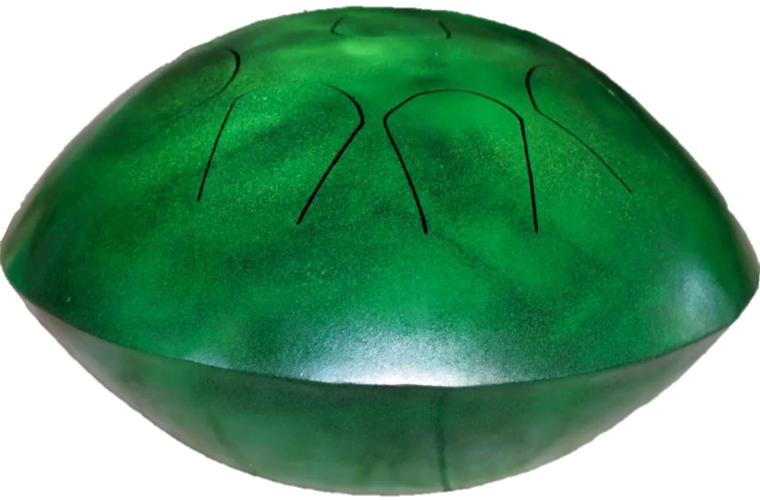

---
# About widget.
widget: "project"  # See https://sourcethemes.com/academic/docs/page-builder/
#headless : false  # This file does not represent a page section.
active : true  # Activate this widget? true/false
weight : 42  # Order that this section will appear in.

# Project title.
title : "Bachelor Thesis"

# Date this page was created.
date : 2019-02-27T00:00:00

# Project summary to display on homepage.
summary : "Acoustic Model of a Steel Tongue Drum"

# Tags: can be used for filtering projects.
tags : ["Acoustics", "Modes of Vibration", "Musical Instrument", "Modal Simulation"]

# Optional external URL for project (replaces project detail page).
external_link : ""

# Slides (optional).
#   Associate this project with Markdown slides.
#   Simply enter your slide deck's filename without extension.
#   E.g. `slides = "example-slides"` references 
#   `content/slides/example-slides.md`.
#   Otherwise, set `slides = ""`.
slides : ""

# Links (optional).
url_pdf : "/files/Bachelor_Thesis.pdf"
url_slides : ""
url_video : ""
url_code : ""

# Custom links (optional).
#   Uncomment line below to enable. For multiple links, use the form `[{...}, {...}, {...}]`.
#url_custom : [{icon_pack = "fab", icon="twitter", name="Follow", url = "https://twitter.com/georgecushen"}]

# Featured image
# To use, add an image named `featured.jpg/png` to your project's folder. 
image:
  # Caption (optional)
  caption : "Modal Simulation of the Steel Tongue Drum"
  
  # Focal point (optional)
  # Options: Smart, Center, TopLeft, Top, TopRight, Left, Right, BottomLeft, Bottom, BottomRight
  focal_point : "Center"
  
  preview_only: false
  
# Choose the user profile to display
# This should be the username of a profile in your `content/authors/` folder.
# See https://sourcethemes.com/academic/docs/get-started/#introduce-yourself
author : "admin"
---

The Steel Tongue Drum is a recently invented musical instrument that consists of
a curved and cutted steel plate. The instrument is mainly handcrafted, so by the
time of this research there wasn't any study on its acoustic properties. For
this reason, the idea of my bachelor thesis was to propose a scientific approach
on designing this instrument.

The first step was to understand which mechanical characteristics determines the
acoustic response. The null hypothesis was that the main factor that contributes
to its acoustic response is the metallic structure's modes of vibration.
Therefore, I scanned the musical instrument using the software Autodesk ReCap,
that gathers photos from different angles and makes a 3d mesh out of it.

<table><tr>
<td> 
<td> 
</tr></table>

After scaling the mesh to the appropriate dimensions (using the rule placed at
the table), the mesh was imported into a CAD software (PTC Creo), and a
parametric model was drawn following the mesh geometry.

<table><tr>
<td> 
<td> 
</tr></table>

The mechanical process used to conform the plate to its curved shape makes its
thickness uneven, given by the sine of the shear angle.

<table><tr>
<td> 
<td> 
</tr></table>

In order to consider that into our 3D model, we parameterize the thickness based
on the normal angle of the surface, giving the following thickness curve.

The next step is to run a modal analysis, so I imported the parametric model
into the software Ansys Workbench and applied a fixed constraint in the contact
point of the instrument with the ground. I also refined the mesh around the
edges of each tongue.

<table><tr>
<td> 
<td> 
</tr></table>

The result of the modal simulation is the shape of each mode and its
corresponding frequency. One can observe that the first 2 modes are related to
the "free body" modes, therefore are ignored in our analysis.

The modes that have significantly more displacement on specific tongues
indicates that when hitting that tongue, that frequency will be excited. In that
manner, we can associate that frequency with the underlying tongue, giving us a
summary table relating each tongue to a specific frequency.

With the results of the simulation in hands, it's time to perform an acoustic
test on an anechoic chamber. The base of the instrument was excited with a
mechanical actuator, and the microphone placed above the instrument recorded the
response.

<table><tr>
<td> 
<td> 
<td> 
</tr></table>

The input was a logarithmic Sine Sweep from 100Hz to 1000Hz that took an hour
long to complete. The result can be then plotted as a Bode Diagram showing the
Frequency response Mic/Force.

The peak frequencies were then compared with the frequencies found in the modal
simulation, resulting in the comparison chart below.

As the curves look almost exactly the same, one can cannot discard the null
hypothesis, indicating that the viscous interaction with the fluid is indeed
negligible, and the only relevant characteristics were the geometry and material
of the instrument. Therefore, the frequencies of each note of the instrument can
be approximated by a simple modal analysis, enabling one to design new
instruments with desired notes. You can take a look at
the [full report (in portuguese)](/files/Bachelor_Thesis.pdf) for more details.
