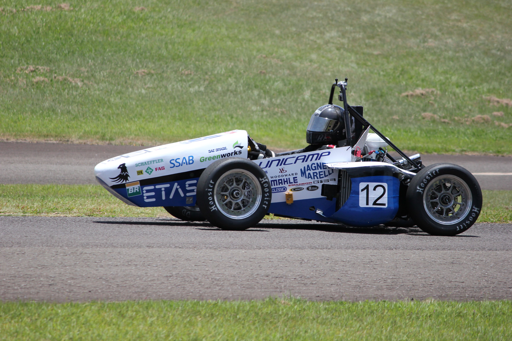
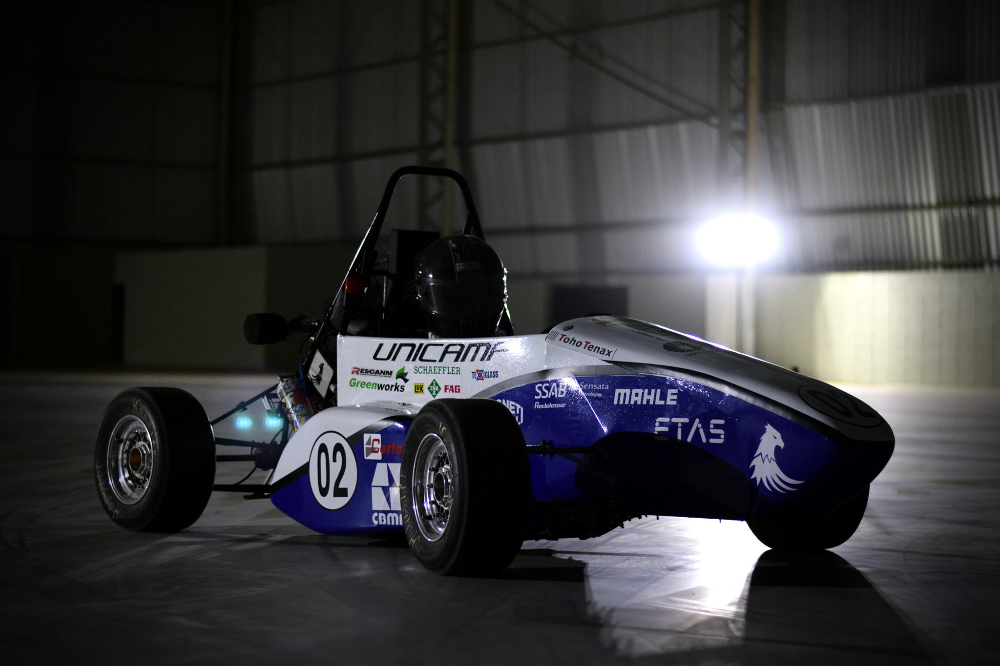
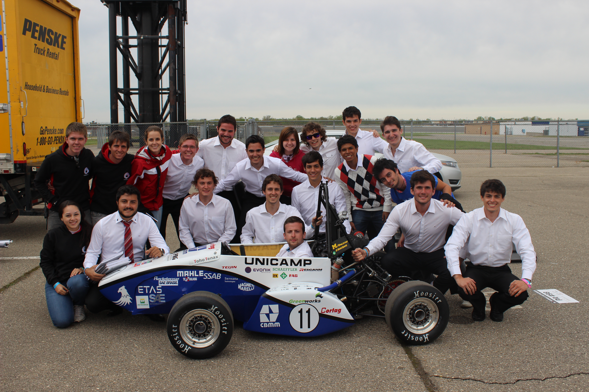
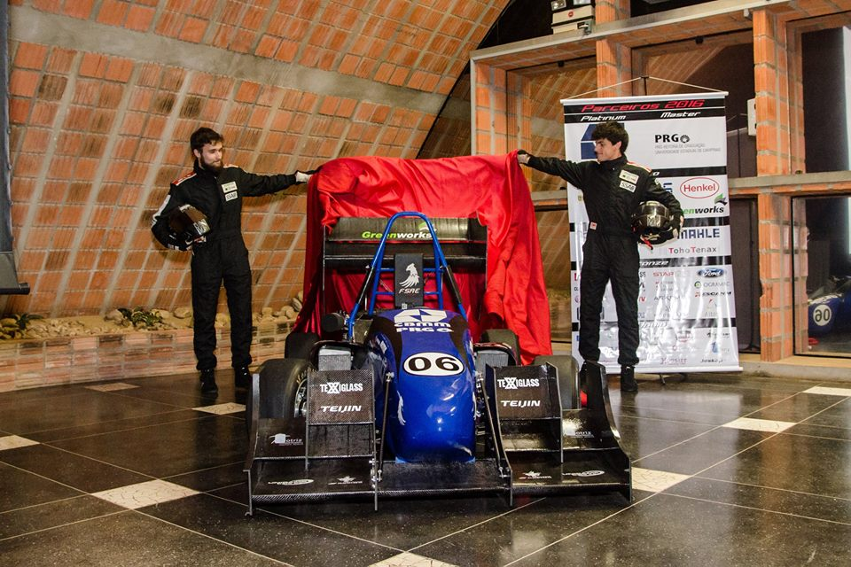

---
# About widget.
widget: "project" # See https://sourcethemes.com/academic/docs/page-builder/
#headless : false  # This file does not represent a page section.
active: true # Activate this widget? true/false
weight: 54 # Order that this section will appear in.

# Project title.
title: "Formula Student/SAE"

# Date this page was created.
date: 2019-02-27T00:00:00

# Project summary to display on homepage.
summary: "Design, Build and Compete!"

# Tags: can be used for filtering projects.
tags: ["Formula Student-SAE", "International Competition"]

# Optional external URL for project (replaces project detail page).
external_link: ""

# Slides (optional).
#   Associate this project with Markdown slides.
#   Simply enter your slide deck's filename without extension.
#   E.g. `slides = "example-slides"` references
#   `content/slides/example-slides.md`.
#   Otherwise, set `slides = ""`.
slides: ""

# Links (optional).
url_pdf: ""
url_slides: ""
url_video: ""
url_code: ""

# Custom links (optional).
#   Uncomment line below to enable. For multiple links, use the form `[{...}, {...}, {...}]`.
#url_custom : [{icon_pack = "fab", icon="twitter", name="Follow", url = "https://twitter.com/georgecushen"}]

# Featured image
# To use, add an image named `featured.jpg/png` to your project's folder.
image:
  # Caption (optional)
  caption: "Before the design presentation at the Michigan Competition - 2015"

  # Focal point (optional)
  # Options: Smart, Center, TopLeft, Top, TopRight, Left, Right, BottomLeft, Bottom, BottomRight
  focal_point: "Center"

  preview_only: false

# Choose the user profile to display
# This should be the username of a profile in your `content/authors/` folder.
# See https://sourcethemes.com/academic/docs/get-started/#introduce-yourself
author: "admin"
---

The [Formula Student/SAE](https://en.wikipedia.org/wiki/Formula_SAE) is an international competition where students design, build and compete with a 'mini formula 1' car. It is the biggest engineering student competition, gathering more than 600 teams from all over the world.

During my 5-year participation at the UNICAMP Team, I had the oportunity to compete in 4 national competitions (Brazil) and 2 international competitions (Lincoln and Michigan - USA), presenting the project to several honorable names from the automotive industry.

### 2013 - Formula SAE Brasil (40 teams):

In my first year of participation on the Formula Student/SAE team, I was responsible for supporting the team with manual labor while learning how the project and the team work through the full year cycle.

- 1st Position in the Presentation Event
- 1st Position in the Acceleration Event
- 2nd Position in the SkidPad Event
- 2nd Position in the Endurance Event
- 3rd Position in the Design Event
- 3rd Position in the Cost and Manufaturing Event
- 3rd Position in the Autocross Event
- 2nd Position Overall

### 2014 - Formula SAE Brasil (40 teams):

In my second year working on this project, I led the suspension division, keeping the members motivated and connected with the project. I managed team resources through the design, manufacturing and testing phases.

- 1st Position in the Cost and Manufaturing Event
- 1st Position in the Fuel Economy Event
- 3rd Position in the Design Event
- 3rd Position in the Acceleration Event
- 4th Position in the SkidPad Event
- 4rd Position in the Endurance Event
- 5th Position in the Autocross Event
- 5th Position in the Presentation Event
- 2nd Position Overall

### 2015 - Formula SAE West - Michigan, USA (120 teams):

The most gratifying moment of my life: when the project I designed is aknowledged as the 4th best design of the year at one of the most recognized Formula Student competitions.

- 3rd Position in the Acceleration Event
- 4th Position in the Design Event
- 19th Position in the SkidPad Event
- 20th Position in the Cost and Manufacturing Event
- 24th Position in the Presentation Event
- 49th Position in the Autocross Event
- 38th Position Overall

### 2015 - Formula SAE Brasil (40 teams):

In the third year working on the Formula Student Team, I managed the interaction between the divisions of suspension, steering, brakes and aerodynamics, from the design phase to the manufacturing and testing phases.

<space><space>

- 1st Position in the Presentation Event
- 1st Position in the Acceleration Event
- 2nd Position in the Design Event
- 2nd Position in the SkidPad Event
- 4th Position in the Cost and Manufaturing Event
- 5th Position in the Autocross Event
- 6th Position Overall

### 2016 - Formula SAE Brasil (40 teams):

In the fourth year working on the Formula Student Team, I managed the interaction between the divisions of suspension, steering, brakes and aerodynamics, from the design phase to the manufacturing and testing phases.

- 1st Position in the Cost and Manufaturing Event
- 1st Position in the Acceleration Event
- 2nd Position in the Design Event
- 2nd Position in the SkidPad Event
- 5th Position in the Presentation Event
- 5th Position in the Autocross Event
- 4th Position Overall

### 2017 - Formula SAE Brasil (40 teams):

As a former member, I supported the new team leaders with advices in general decisions.

- 2nd Position in the Cost and Manufaturing Event
- 5th Position in the Design Event
- 10th Position in the Presentation Event
- 10th Position in the Autocross Event
- 13th Position Overall
