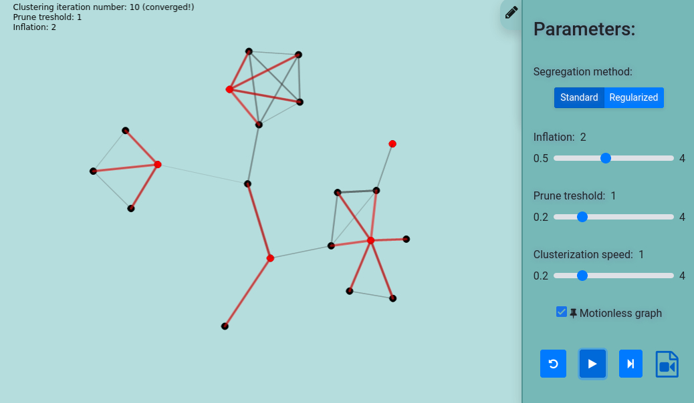

---
# About widget.
widget: "project" # See https://sourcethemes.com/academic/docs/page-builder/
#headless : false  # This file does not represent a page section.
active: true # Activate this widget? true/false
weight: 05 # Order that this section will appear in.

# Project title.
title: "Markov Clustering Algorithm"

# Date this page was created.
date: 2020-05-27T00:00:00

# Project summary to display on homepage.
summary: "Interactive webpage to explore the influence of each parameter of the Markov Clustering Algorithm"

# Tags: can be used for filtering projects.
tags: ["JavaScript", "Clustering", "Markov", "Web Development", "Data Science"]

# Optional external URL for project (replaces project detail page).
external_link: ""

# Slides (optional).
#   Associate this project with Markdown slides.
#   Simply enter your slide deck's filename without extension.
#   E.g. `slides = "example-slides"` references
#   `content/slides/example-slides.md`.
#   Otherwise, set `slides = ""`.
slides: ""

# Links (optional).
url_pdf: ""
url_slides: ""
url_video: ""
url_code: ""

# Custom links (optional).
#   Uncomment line below to enable. For multiple links, use the form `[{...}, {...}, {...}]`.
#url_custom : [{icon_pack = "fab", icon="twitter", name="Follow", url = "https://twitter.com/georgecushen"}]

# Featured image
# To use, add an image named `featured.jpg/png` to your project's folder.
image:
  # Caption (optional)
  caption: ""

  # Focal point (optional)
  # Options: Smart, Center, TopLeft, Top, TopRight, Left, Right, BottomLeft, Bottom, BottomRight
  focal_point: "Center"

  preview_only: false

# Choose the user profile to display
# This should be the username of a profile in your `content/authors/` folder.
# See https://sourcethemes.com/academic/docs/get-started/#introduce-yourself
author: "admin"
---

During one of my epiphanies studying subjects related to data science, I've stumbled across a not-so-well-known clustering algorithm. After a few researches on that topic, I realized that I would benefit from a visual tool to test its parameters and evaluate their influence.

In that occasion, I was studying web development, hence I decided to exercise my knowledge in a hands-on project. Take a look at the result !

"The MCL algorithm is short for the Markov Cluster Algorithm, a fast and scalable unsupervised cluster algorithm for graphs (also known as networks) based on simulation of (stochastic) flow in graphs." - van Dongen, the author. Check [the author's page](https://www.micans.org/mcl/) for more information.

The original method has only two parameters (Inflation and Prune Treshold):

- The purpose of the inflation parameter is to reduce the connections across small communities - "rich get richer, poor get poorer".

- The prune treshold accelerates convergence by removing weak connections at each iteration.

The original algorithm has some known limitations: outputs many small clusters and does not scale well. To solve the first problem, [Srinivas Parthasarathy proposed](https://www.youtube.com/watch?v=574z9nisRuE&ab_channel=VIC) the 'regularized segregation method' that allows more control over cluster sizes. He has also proposed solutions to enable the algorithm to scale better, but those were not considered in my project.
